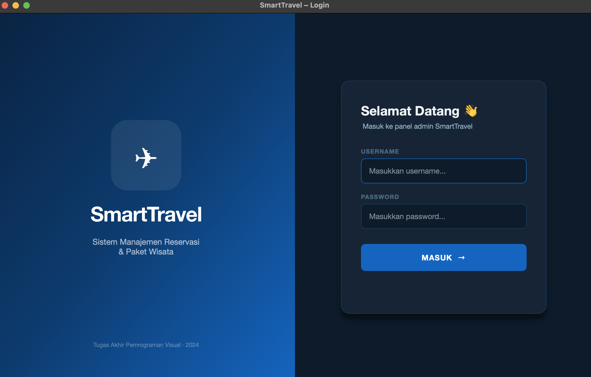
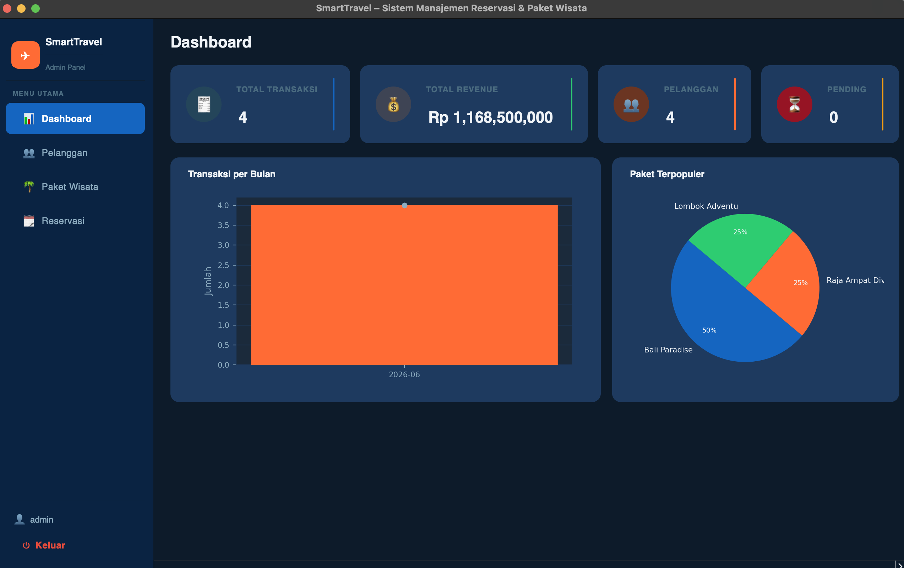
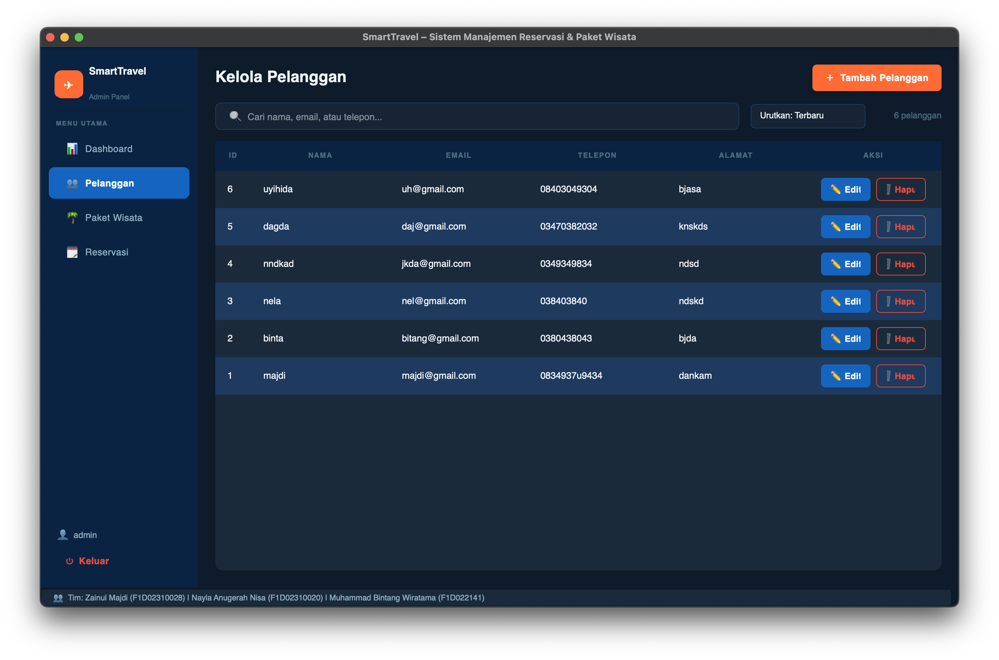
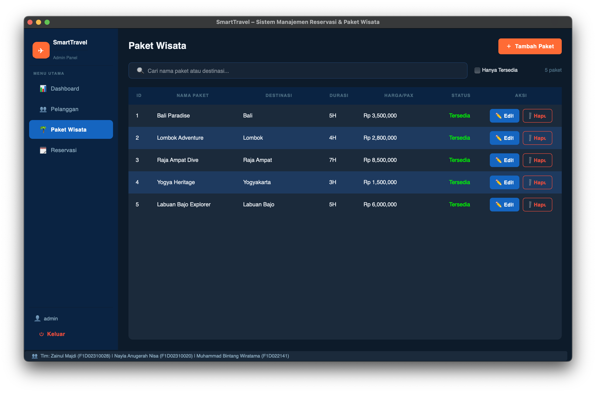
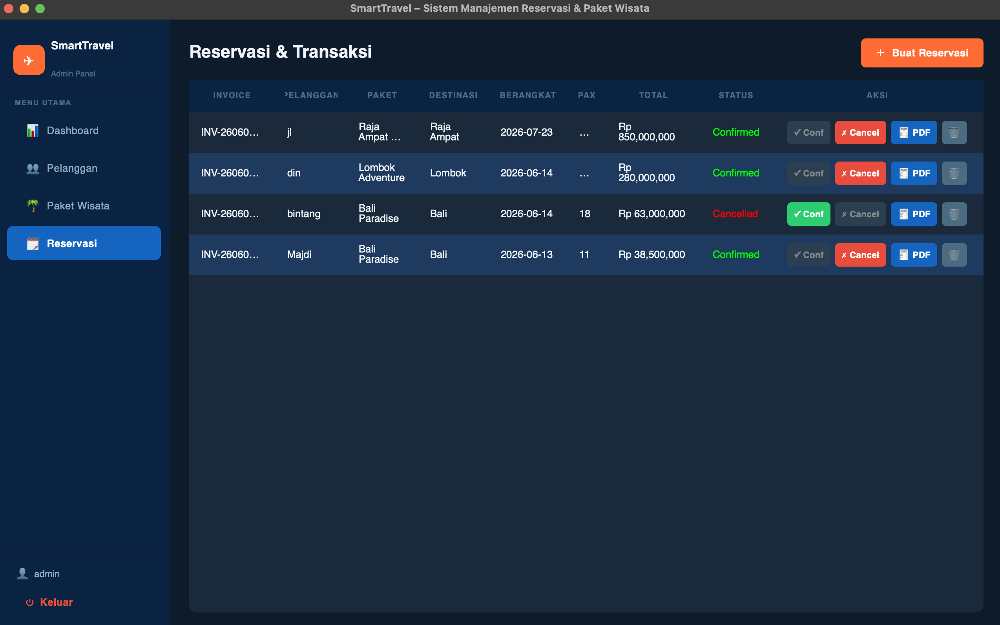

# ✈️ SmartTravel
### Sistem Manajemen Reservasi & Paket Wisata Berbasis PySide6

> **Tugas Akhir — Pemrograman Visual**
> Universitas Mataram · 2026

---

## 👥 Tim Pengembang

| Nama | NIM | Peran |
|------|-----|-------|
| **Zainul Majdi** | F1D02310028 | Ketua |
| **Nayla Anugerah Nisa** | F1D02310020 | Anggota |
| **Muhammad Bintang Wiratama** | F1D022141 | Anggota |

---

## 📋 Deskripsi Proyek

**SmartTravel** adalah aplikasi desktop berbasis GUI yang dirancang untuk mempermudah agen perjalanan (*travel agency*) dalam mengelola data pelanggan dan operasional pemesanan paket wisata secara digital dan terintegrasi.

Aplikasi ini dibangun menggunakan **framework PySide6** (Qt for Python) dengan arsitektur **MVC (Model-View-Controller)**, database relasional **SQLite**, dan dilengkapi fitur pembuatan **Invoice PDF otomatis** serta **Dashboard visual** untuk memantau statistik penjualan secara real-time.

---

## 🖥️ Tampilan Aplikasi

### Halaman Login
Tampilan split-panel premium dengan branding kiri dan form login kanan. Terdapat animasi *shake* saat login gagal.



### Dashboard
Menampilkan 4 kartu statistik (total transaksi, revenue, pelanggan, pending) beserta grafik batang transaksi per bulan dan pie chart paket terpopuler.



### Kelola Pelanggan
Tabel CRUD lengkap dengan fitur pencarian real-time berdasarkan nama, email, atau nomor telepon.



### Paket Wisata
Manajemen daftar paket wisata dengan informasi destinasi, durasi, harga per pax, dan status ketersediaan.



### Reservasi & Transaksi
Proses pemesanan terintegrasi: pilih pelanggan & paket → kalkulasi otomatis → update status → cetak invoice PDF.



---

## ✨ Fitur Utama

| Fitur | Keterangan |
|-------|------------|
| 🔐 **Autentikasi Login** | Sistem login dengan validasi username & password + animasi error |
| 👥 **Kelola Pelanggan** | CRUD data pelanggan + pencarian real-time |
| 🌴 **Kelola Paket Wisata** | CRUD paket dengan harga, durasi, dan status ketersediaan |
| 🗓️ **Proses Reservasi** | Buat reservasi, kalkulasi total otomatis, update status (Pending / Confirmed / Cancelled) |
| 🧾 **Invoice PDF** | Generate invoice profesional berformat PDF menggunakan ReportLab, tersimpan otomatis |
| 📊 **Dashboard Monitoring** | Grafik transaksi per bulan (bar chart) & paket terpopuler (pie chart) via Matplotlib |
| 🗃️ **Database SQLite** | Penyimpanan persisten dengan foreign key, auto-seed 5 paket wisata contoh |
| 🎨 **UI Dark Theme** | Antarmuka gelap elegan dengan palet warna navy-biru-oranye yang konsisten |

---

## 🏗️ Arsitektur Proyek (MVC)

```
smarttravel/
├── main.py                        # Entry point — inisialisasi app & alur login→main
│
├── config/
│   └── database.py                # Koneksi SQLite, inisialisasi skema, seed data awal
│
├── models/                        # MODEL — akses & manipulasi data
│   └── models.py                  # Dataclass + CRUD: User, Pelanggan, PaketWisata, Transaksi
│
├── controllers/                   # CONTROLLER — logika bisnis
│   └── controllers.py             # AuthController, PelangganController,
│                                  # PaketController, TransaksiController
│
├── views/                         # VIEW — antarmuka pengguna (PySide6)
│   ├── login_view.py              # Halaman login split-panel
│   ├── main_window.py             # Window utama + sidebar navigasi
│   ├── dashboard_view.py          # Dashboard statistik + grafik
│   ├── pelanggan_view.py          # Halaman CRUD pelanggan
│   ├── paket_view.py              # Halaman CRUD paket wisata
│   └── transaksi_view.py          # Halaman reservasi & transaksi
│
├── utils/
│   ├── theme.py                   # Konstanta warna & stylesheet global
│   └── pdf_generator.py           # Generator invoice PDF (ReportLab)
│
├── database/
│   ├── smarttravel.db             # File database SQLite (dibuat otomatis saat run pertama)
│   └── invoices/                  # Folder penyimpanan invoice PDF hasil generate
│
└── requirements.txt               # Daftar dependensi Python
```

### Alur Arsitektur MVC

```
┌─────────┐   event / input   ┌────────────┐   panggil method   ┌─────────┐
│  VIEW   │ ────────────────► │ CONTROLLER │ ──────────────────► │  MODEL  │
│(PySide6)│                   │  (logic)   │                     │(SQLite) │
│         │ ◄──────────────── │            │ ◄─────────────────  │         │
└─────────┘   update UI       └────────────┘   return data       └─────────┘
```

---

## 🗄️ Skema Database

### Tabel `users`
| Kolom | Tipe | Keterangan |
|-------|------|------------|
| id | INTEGER PK | Auto increment |
| username | TEXT UNIQUE | Username login |
| password | TEXT | Password (plaintext) |
| role | TEXT | Peran user (default: `admin`) |
| created_at | DATETIME | Waktu dibuat |

### Tabel `pelanggan`
| Kolom | Tipe | Keterangan |
|-------|------|------------|
| id | INTEGER PK | Auto increment |
| nama | TEXT | Nama lengkap pelanggan |
| email | TEXT UNIQUE | Alamat email |
| telepon | TEXT | Nomor telepon |
| alamat | TEXT | Alamat lengkap |
| created_at | DATETIME | Waktu didaftarkan |

### Tabel `paket_wisata`
| Kolom | Tipe | Keterangan |
|-------|------|------------|
| id | INTEGER PK | Auto increment |
| nama_paket | TEXT | Nama paket wisata |
| destinasi | TEXT | Kota/lokasi tujuan |
| durasi_hari | INTEGER | Lama perjalanan (hari) |
| harga | REAL | Harga per orang (Rp) |
| deskripsi | TEXT | Keterangan paket |
| tersedia | INTEGER | Status: 1=Tersedia, 0=Nonaktif |

### Tabel `transaksi`
| Kolom | Tipe | Keterangan |
|-------|------|------------|
| id | INTEGER PK | Auto increment |
| kode_invoice | TEXT UNIQUE | Kode unik (format: INV-YYMMDD-XXXX) |
| pelanggan_id | INTEGER FK | Referensi ke `pelanggan.id` |
| paket_id | INTEGER FK | Referensi ke `paket_wisata.id` |
| tanggal_pesan | DATE | Tanggal pemesanan |
| tanggal_berangkat | DATE | Tanggal keberangkatan |
| jumlah_orang | INTEGER | Jumlah peserta |
| total_harga | REAL | Total biaya (harga × jumlah_orang) |
| status | TEXT | `Pending` / `Confirmed` / `Cancelled` |
| catatan | TEXT | Catatan tambahan |

---

## 🚀 Cara Menjalankan

### 1. Prasyarat

Pastikan Python **3.10 atau lebih baru** sudah terinstall:
```bash
python --version
```

### 2. Clone / Download Proyek

```bash
# Clone via git
git clone https://github.com/username/smarttravel.git
cd smarttravel

# Atau ekstrak file ZIP yang sudah diunduh
cd smarttravel
```

### 3. Buat Virtual Environment (Disarankan)

```bash
# Buat virtual environment
python -m venv venv

# Aktifkan (Windows)
venv\Scripts\activate

# Aktifkan (macOS / Linux)
source venv/bin/activate
```

### 4. Install Dependensi

```bash
pip install -r requirements.txt
```

Daftar library yang akan diinstall:

| Library | Versi | Fungsi |
|---------|-------|--------|
| `PySide6` | ≥ 6.6.0 | Framework GUI (Qt for Python) |
| `reportlab` | ≥ 4.0.0 | Generate invoice PDF |
| `matplotlib` | ≥ 3.8.0 | Grafik dashboard (opsional) |

### 5. Jalankan Aplikasi

```bash
python main.py
```

> ✅ Database `smarttravel.db` akan dibuat **otomatis** di folder `database/` pada saat pertama kali dijalankan, beserta 5 paket wisata contoh sebagai data awal.

### 6. Login

| Field | Value |
|-------|-------|
| **Username** | `admin` |
| **Password** | `admin123` |

---

## 📄 Cara Menggunakan Fitur Invoice PDF

1. Buka halaman **Reservasi**
2. Klik **＋ Buat Reservasi** → isi data → klik **Buat Reservasi**
3. Saat dialog konfirmasi muncul, klik **Ya** untuk langsung cetak PDF
4. Atau pada tabel, klik tombol **🧾 PDF** pada baris transaksi yang diinginkan
5. File PDF tersimpan otomatis di: `database/invoices/INV-XXXXXX.pdf`

---

## ⚙️ Troubleshooting

### Grafik tidak muncul di Dashboard
Pastikan matplotlib sudah terinstall:
```bash
pip install matplotlib
```

### Error saat cetak PDF
Pastikan reportlab sudah terinstall:
```bash
pip install reportlab
```

### PySide6 gagal diinstall (Python 3.12+)
Coba perbarui pip terlebih dahulu:
```bash
pip install --upgrade pip
pip install PySide6
```

### Database error / corrupt
Hapus file `database/smarttravel.db` dan jalankan ulang. Database akan dibuat ulang secara otomatis.

---

## 🛠️ Teknologi yang Digunakan

| Teknologi | Versi | Keterangan |
|-----------|-------|------------|
| Python | 3.10+ | Bahasa pemrograman utama |
| PySide6 | 6.6+ | Framework GUI berbasis Qt |
| SQLite | 3.x | Database relasional lokal |
| ReportLab | 4.0+ | Pembuatan dokumen PDF |
| Matplotlib | 3.8+ | Visualisasi data / grafik |

---

## 📝 Lisensi

Proyek ini dibuat untuk keperluan **Tugas Akhir Mata Kuliah Pemrograman Visual**.  
Hak cipta © 2026 — Zainul Majdi, Nayla Anugerah Nisa, Muhammad Bintang Wiratama.
